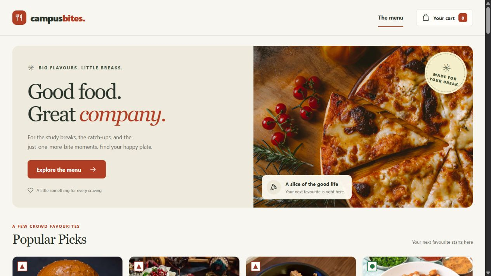
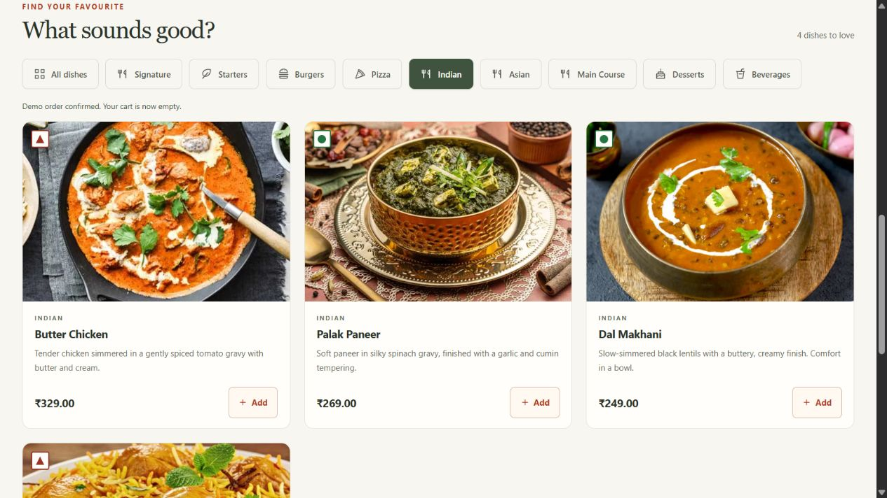
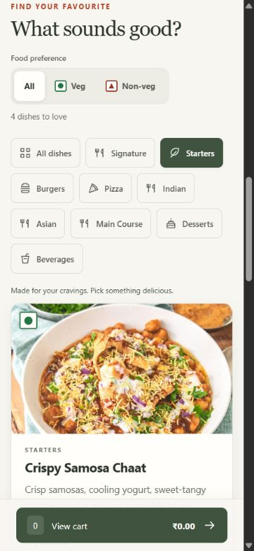
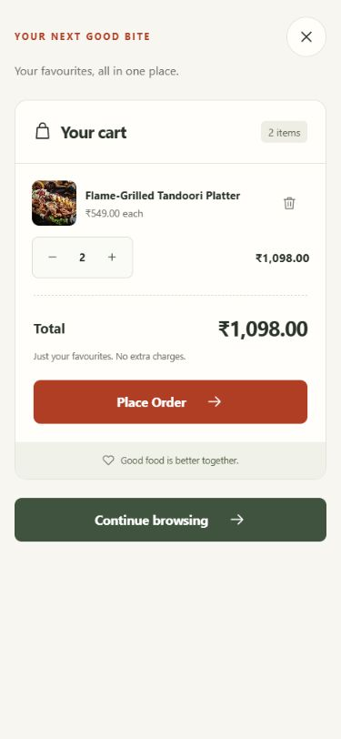

# Campus Bites

A responsive food ordering interface for a university frontend project. Browse 36 dishes, filter by category, and build a cart with accurate Indian rupee totals.

Built with **React + Vite, JavaScript, and plain CSS**. Only React and React DOM are runtime dependencies.





<details>
<summary>Mobile menu and cart screenshots</summary>




</details>

## Features

- Restaurant hero banner with locally bundled food photography.
- 36 dishes: four each in Signature, Starters, Burgers, Pizza, Indian, Asian, Main Course, Desserts, and Beverages.
- Category filtering with selected-state indicators and result counts.
- All / Veg / Non-veg food preference switch combines with categories and filters Popular Picks without changing the cart.
- Reusable cards with names, descriptions, local images, INR prices, and vegetarian/non-vegetarian symbols.
- Four Popular Picks share the same menu records and live cart quantities.
- Chennai footer with opening hours, counter contact information, and a fictional shop address.
- Add and change quantities directly on menu cards, Popular Picks, or in the cart drawer.
- Place a demo order inside the drawer: enter a name and table number, review the INR summary, and confirm to see a reference number and clear the cart.
- Quantity limits of 1–99; minus at one removes the item and keeps keyboard focus usable.
- Exact totals calculated with integer paise.
- Empty cart, maximum-quantity, no-results, and failed-image states.
- Mobile cart shortcut and a separate slide-out cart on every screen size.
- Keyboard controls, focus recovery after removal, status announcements, and reduced-motion support.

## Run locally

Prerequisites: **Node.js 24.19.0** and **pnpm 11.25.0**. The Node version is recorded in `.node-version`; `package.json` pins the package manager. Use pnpm for this repository so the single lockfile stays authoritative.

From the project directory:

```sh
pnpm install --frozen-lockfile
pnpm dev
```

Open the address printed by Vite, normally **http://127.0.0.1:5173**. Stop the server with Ctrl+C. If the port is occupied, Vite may choose the next free port.

The development tools need network access for the first dependency installation. The application itself makes no external API, font, or image requests.

### Bundled Windows tooling

In the original Codex workspace, Node and pnpm are already bundled. If another PowerShell terminal does not find them, add their existing folders to that terminal's PATH (this does not install software or change system settings):

```powershell
$runtime = Join-Path $env:USERPROFILE '.cache\codex-runtimes\codex-primary-runtime\dependencies'
$env:Path = "$runtime\node\bin;$runtime\bin\fallback;$env:Path"
node --version
pnpm --version
pnpm install --frozen-lockfile
pnpm dev
```

On another computer, use its own Node/pnpm installation rather than this machine-specific bundled location.

## Commands

| Command         | Purpose                                                             |
| --------------- | ------------------------------------------------------------------- |
| `pnpm dev`      | Start the development server                                        |
| `pnpm lint`     | Check JavaScript, React Hooks, and JSX accessibility; warnings fail |
| `pnpm test`     | Run tests in watch mode                                             |
| `pnpm test:run` | Run the full automated suite once                                   |
| `pnpm build`    | Create the production site in `dist/`                               |
| `pnpm preview`  | Serve the production build, normally on port 4173                   |

Run `pnpm build` before `pnpm preview`. The generated site needs a static HTTP server; opening `index.html` directly with a `file:` URL is not the supported setup. Vite uses a relative base path so the build can also be hosted in a subdirectory.

## Project structure

```text
src/
  assets/          Local food photos, fallback illustration, favicon
  components/      Header, hero, filtering, menu cards, cart, icons
  data/            Menu records, categories, lookup and filter helper
  state/           Cart reducer, derived summary, unit tests
  styles/          Design tokens, global rules, layout, component styles
  test/            Test cleanup and jsdom setup
  utils/           Shared INR formatter
  config.js        Brand, INR locale/currency, quantity limit
  App.jsx          Shared state and component wiring
  App.test.jsx     User-flow integration and edge-state tests
  main.jsx         React entry point
docs/
  screenshots/     Captured desktop and mobile interfaces
  image-credits.md Photographer and source attribution
  testing.md       Verification results and manual test checklist
.github/workflows/ci.yml
```

The workspace's `work/` and `outputs/` folders are ignored and are not application dependencies.

## Architecture

`App` owns the cart through `useReducer` and the active category and drawer visibility through `useState`. It passes data and named callbacks down through props. The tree is shallow enough that Context or a global state library would add complexity without a useful benefit.

```text
App
├── Header
├── Hero
├── CategoryFilter
├── FoodGrid (menu + Popular Picks) → FoodCard → FoodImage + DietIndicator + QuantityControl
├── CartDrawer → Cart → CartItem → QuantityControl + FoodImage
│              → CheckoutForm → OrderSummary
│              → OrderSuccess → OrderSummary
├── CartShortcut
└── Footer
```

`Icon` renders the shared decorative SVG icons. `FoodImage` handles fixed image dimensions and a one-time fallback. The empty state and total belong to `Cart` rather than extra tiny components.

### Menu records

`src/data/menu.js` defines categories and food records with these fields:

| Field         | Example                       | Meaning                        |
| ------------- | ----------------------------- | ------------------------------ |
| `id`          | `pizza-margherita`            | Stable unique ID and React key |
| `name`        | `Classic Margherita`          | Display name                   |
| `description` | Short ingredient description  | Card copy                      |
| `categoryId`  | `pizza`                       | ID from the categories array   |
| `priceMinor`  | `24900`                       | Price in paise: ₹249.00        |
| `image`       | Imported WebP                 | Bundled image URL              |
| `imageAlt`    | Description of the photograph | Accessible alternative text    |
| `diet`        | `veg` or `nonveg`              | Green circle or brown triangle, with a screen-reader label |
| `popular`     | `true` (optional)              | Includes this record in Popular Picks |

To add a dish: place its image in `src/assets/images/`, import it in `menu.js`, add a record with a unique ID and integer price, and add the source to the image credits. No food-card markup needs to be copied. Adjust the intentional 36-item/four-per-category dataset checks if the menu size changes.

`menuById` and `popularFoods` are derived from the menu. Popular Picks and the full menu reuse the same cards and reducer; each card has a unique React `useId` heading even when the same dish appears twice. The cart uses it to retrieve product details. `filterMenu` returns all dishes or those matching the selected category; filtering does not change cart state.

### Cart rules

Cart state contains only entries such as `{ foodId: 'pizza-margherita', quantity: 2 }`.

| Action     | Result                                            |
| ---------- | ------------------------------------------------- |
| `add`      | Add a row at 1, or increase its existing quantity |
| `increase` | Increase an existing row, up to 99                |
| `decrease` | Decrease a row; remove it when its quantity is 1               |
| `remove`   | Remove the row entirely                           |

Unknown menu IDs and unsupported actions leave state unchanged. Quantity controls cannot produce negative, zero, or fractional quantities. The reducer uses new arrays and objects instead of mutating previous state.

The `clear` action empties the cart after demo confirmation. `App` owns the drawer step (`cart`, `checkout`, or `success`) and a temporary receipt snapshot. `CheckoutForm` keeps its two inputs and validation errors locally. Names must contain 1–60 characters after trimming; table numbers must be whole numbers from 1 to 999. A submission guard prevents repeated confirmation. The receipt retains items, quantities, integer-paise totals and a locally generated `CB-` reference after the live cart clears. Closing the drawer discards the form/receipt; cancelling before confirmation preserves the cart. No details are transmitted or persisted.

`getCartSummary` derives product details, line totals, total quantity, and total price from the current cart. None of these computed values is stored as separate React state, so there is no second total to keep synchronized.

### Why integer paise?

Binary floating-point arithmetic can represent decimal fractions imprecisely. This project adds and multiplies integers instead:

```text
2 × Classic Margherita at 24,900 paise = 49,800 paise
1 × Fresh Lemonade at 7,900 paise      =  7,900 paise
Total                                = 57,700 paise = ₹577.00
```

The shared formatter divides by 100 only for display and uses `Intl.NumberFormat('en-IN', { style: 'currency', currency: 'INR' })`. All prices are demo menu prices in INR; the total includes no additional fees.

## Responsive design and accessibility

- Below 640 px: single-column cards, stacked hero, wrapping category buttons.
- From 640 px: two card columns.
- From 1024 px: three menu columns and four Popular Picks columns; the mobile shortcut is hidden.
- Popular Picks uses a horizontal, keyboard-accessible card strip on small screens and two columns on tablets.
- The cart opens in a native modal dialog: a 460 px right-hand drawer on desktop and full width on narrow screens. Long carts scroll independently.
- Escape, the backdrop, Close cart, or Continue browsing dismiss the drawer. Opening focuses Close cart; closing returns focus to the opener. Background scrolling is locked while open.
- Mobile bottom padding includes the device safe area so final content stays reachable above the shortcut.
- Controls are semantic buttons/links with visible focus, descriptive names, and 44 px minimum touch targets where practical.
- Category buttons use `aria-pressed`; update messages use a polite status region.
- Removing a focused cart row moves focus to the next row, previous row, or empty-cart heading.
- The hero is decorative; repeated cart thumbnails have empty alt text. Menu photos have descriptive alt text.
- Reduced-motion preferences disable transitions and smooth scrolling.

## Testing and CI

The suite contains **52 tests** covering menu integrity, combined dietary/category filtering, keyboard preference switching, immutable cart updates, quantity boundaries, repeated additions, exact paise totals, invalid IDs, the ordering flow, focus recovery, drawer dismissal, focus/scroll restoration, navigation, reset-on-remount behavior, image fallback states, checkout validation, cancellation, duplicate-submit prevention, receipt preservation and clearing the cart after confirmation.

GitHub Actions is configured to run a frozen-lockfile install, lint, tests, and production build on pushes to `main` and pull requests. The workflow needs a GitHub remote and a push before a hosted run can occur.

See [verification results and manual checklist](docs/testing.md). Browser review and tests complement each other: jsdom checks interactions but cannot validate visual layout.

ESLint 9.39.5 is retained because the installed accessibility plugin declares support through ESLint 9. The package registry marks this ESLint major deprecated; review a compatible upgrade when `eslint-plugin-jsx-a11y` supports ESLint 10. This is a development-tool maintenance limitation, not a runtime dependency.

## Rubric

| Category                          | Project evidence                                                                                       |
| --------------------------------- | ------------------------------------------------------------------------------------------------------ |
| Code quality & architecture — 35% | Reusable components, separate data/reducer/formatter, immutable state, focused tests, formatted source |
| UI/UX & responsiveness — 30%      | Cohesive visual system, local imagery, mobile/desktop layouts, keyboard and motion considerations      |
| Feature completeness — 20%        | Full cart lifecycle, filtering, correct totals, bounds, empty states, image fallback                   |
| Documentation & Git hygiene — 15% | Setup guide, architecture notes, screenshots, image credits, lockfile, CI and focused commit structure |

## Scope and limitations

The footer address and opening hours are fictional demo content. Contact points to the counter rather than an invented phone number or active email address.

This is a frontend demonstration. Checkout accepts a name and table number only for a local simulation; these details stay in memory and are discarded when the drawer closes. It does not submit real orders or process payments. The cart resets on refresh; there is no persistence, backend, authentication, live availability, or pricing API. Photographs illustrate the demo menu and are not product claims by a real restaurant.

See [image credits and reuse sources](docs/image-credits.md). Application screenshots and the SVG interface artwork were created for this project.
